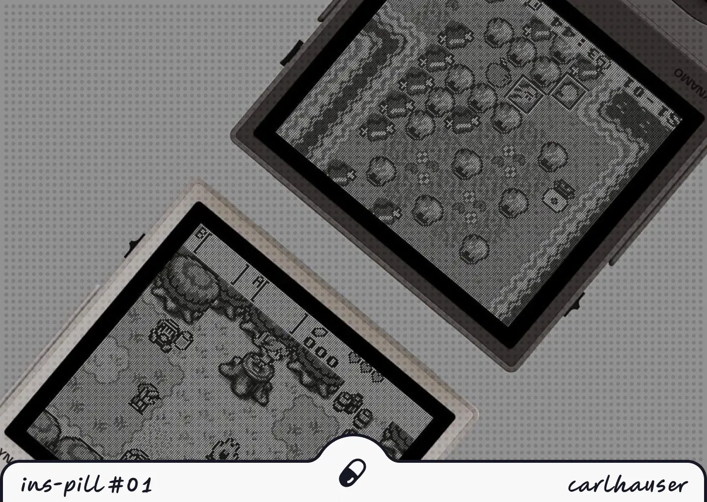
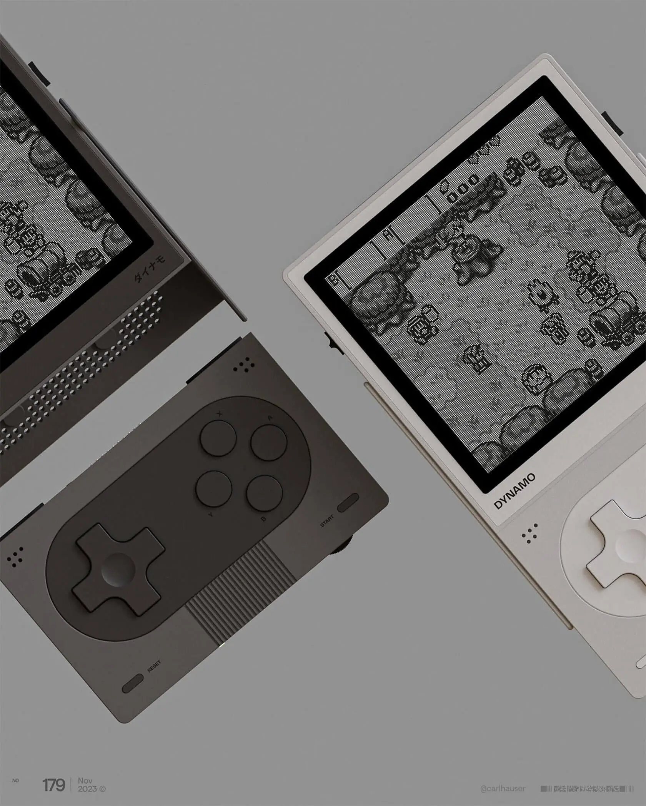
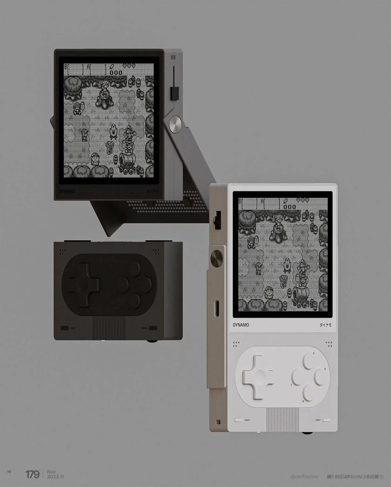
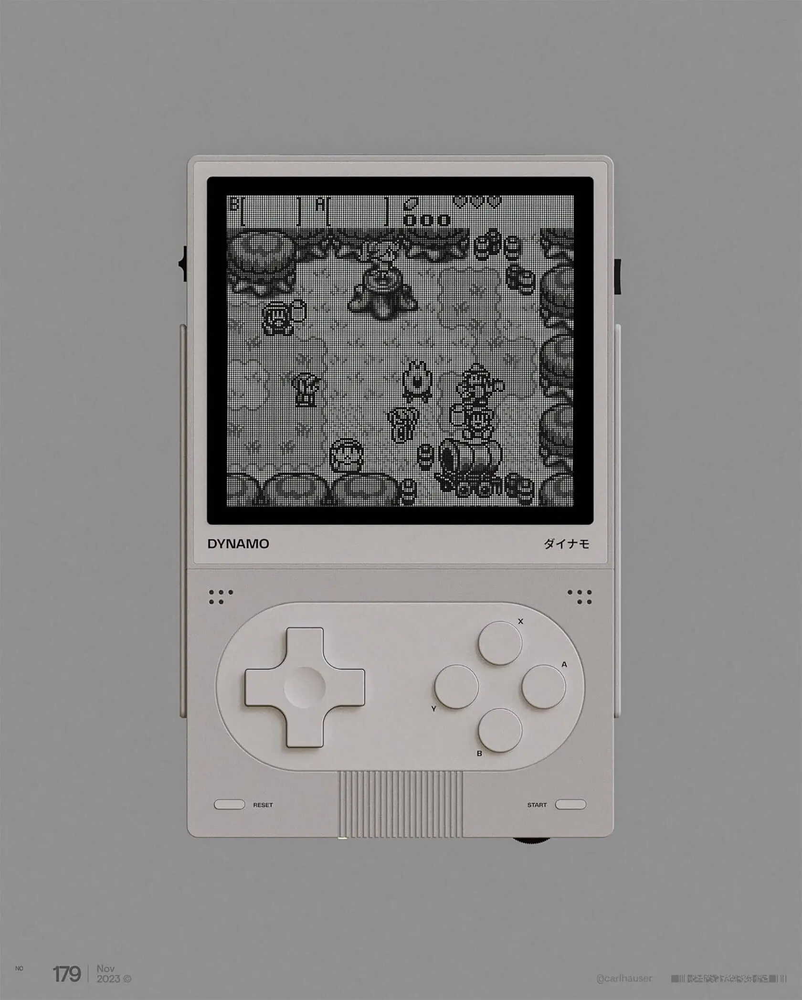
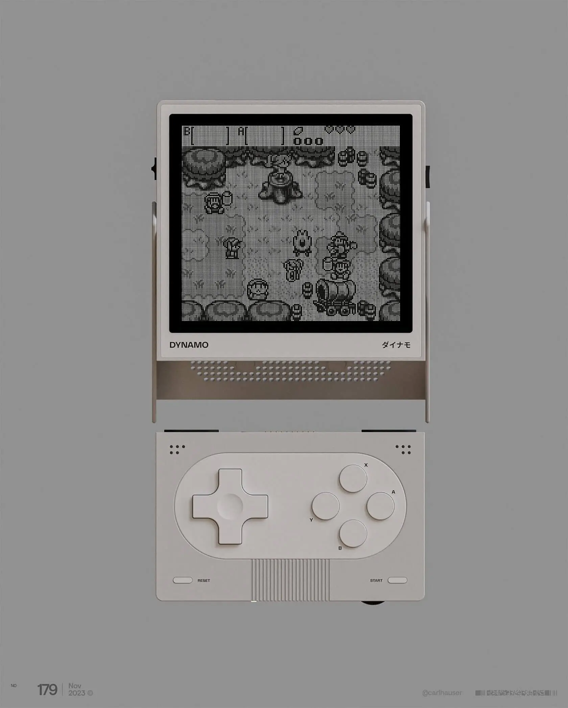
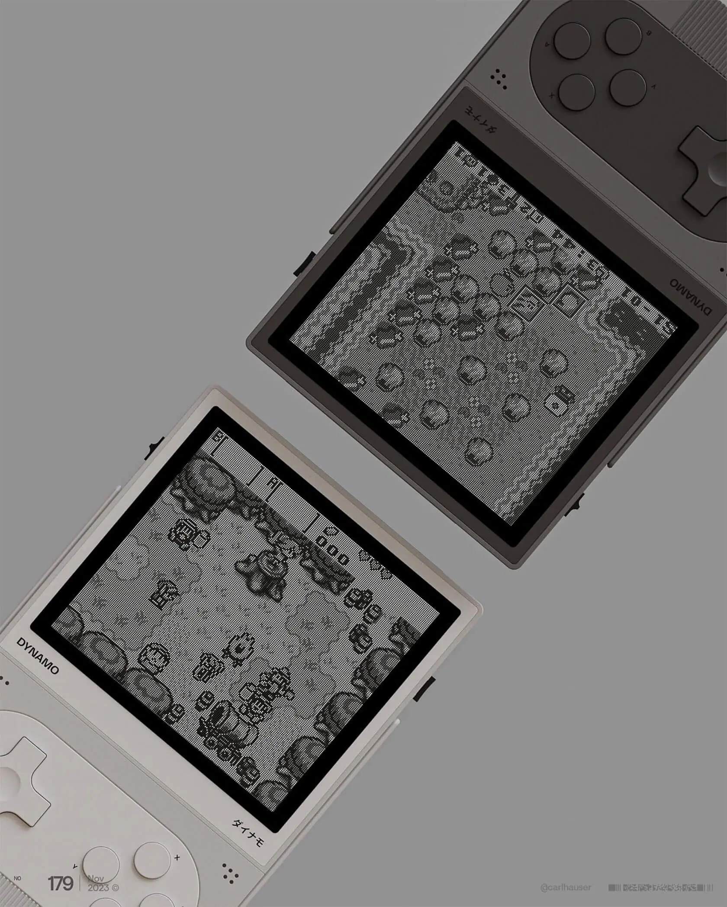

Este post também está disponível em  <a href="https://rr-portifolio-blog.pages.dev/pt-br/blog/inspill/01-inspill-dynamo/" target="_self">Português</a>.

---

German designer Sebastian Stapelfeldt, better known as [carlhauser](https://www.carlhauser.com), captures the essence of the iconic Game Boy with Dynamo, blending a friendly, modern aesthetic.

In two color variations and a minimalist design, the concept strikes a perfect balance between retro and modern, evoking a sense of nostalgia and freshness.

The most surprising feature of this concept is the detachable screen—it can be removed and placed on a surface, for example. This function enhances usability, offering flexibility during gameplay.

I must admit: I’d love to have this handheld!

If you appreciate this concept, check out more inspiring works in Sebastian’s [portfolio](https://www.carlhauser.com).

— Rener Rannieri.