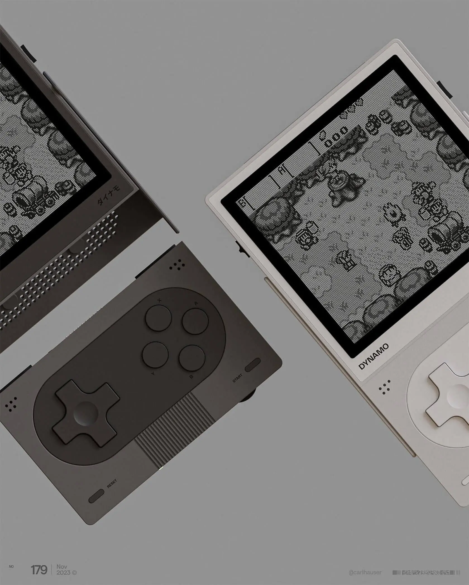
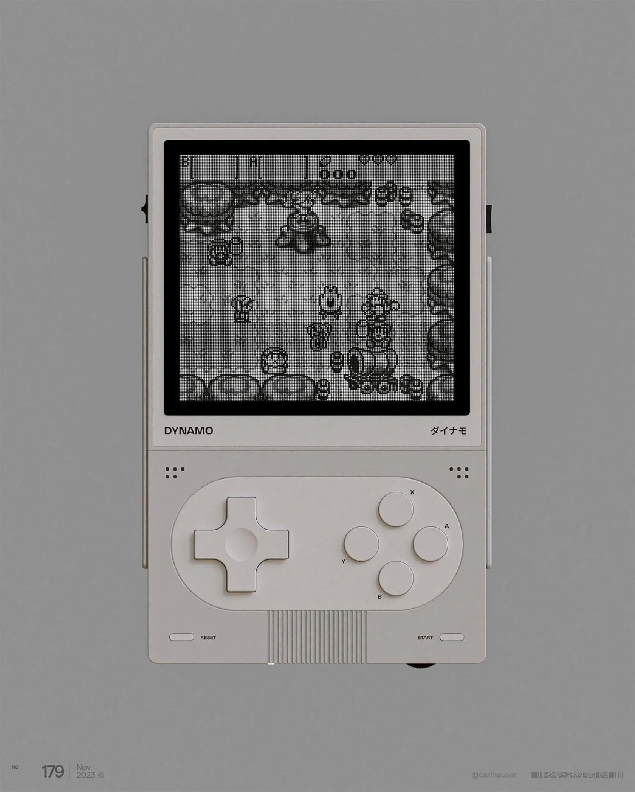

This post is also available in  [English](/blog/inspill/01-inspill-Dynamo/).

---

O designer alemão Sebastian Stapelfeldt, mais conhecido por [carlhauser](https://www.carlhauser.com), capta a essência do icônico Game Boy, junto à estética amigável e moderna, com o Dynamo.

Em duas variações de cores e design minimalista, o conceito é assertivo ao equilibrar retro e modernidade, resultando em sensação de nostalgia e frescor.

O mais surpreendente do conceito é a tela removível — é possível remover e colocar em uma superfície, por exemplo. Essa função melhora a usabilidade, permitindo flexibilidade na jogatina.

Confesso: gostaria de ter esse portátil!

Se você gostou desse conceito, veja mais trabalhos inspiradores no [portfólio](https://www.carlhauser.com) do Sebastian’s.

— Rener Rannieri.